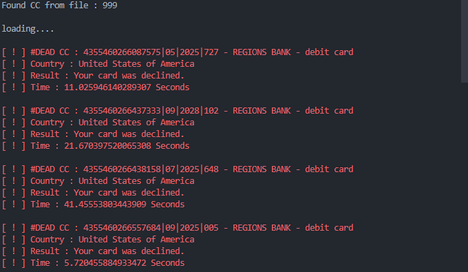

# Stripe-CC-Checker

# Preview

# Termux Android

https://apkcombo.com/id/termux/com.termux/old-versions/0.119.1/

1. pkg upgrade && update
2. pkg install git
3. pkg install python-pip
4. termux-setup-storage
5. git clone https://github.com/mza-xxdv/cc-stripe-checker.git
6. cd cc-stripe-checker
7. pip install -r requirements.txt
8. python main.py

# ALT
pip install "modulname"